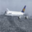
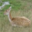
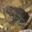
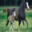
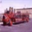

# Final-Project image-clasifier


## project description

this project is an image clasifier, based on the CIFAR10 dataset with 10 clases which are:

- airplanes 

- automobiles 

- birds
 
- cats
 
- deers

- dogs
 
- frogs
 
- horses
 
- ships
 
- trucks



## libraries used
the list of libraries used are:
- os
- argparse
- sys
- keras
- tensorflow
- csv
- tqdm

## usage
the code work wit argparse, you can ask for predict one file or all the files in a folder:
- file:
``` python3 main.py --fil <filepath>```
- folder: 
``` python3 main.py --fol <folderpath>```


## neural net
the neural net used now has a 77% accuracy in validation


## further steps
increase the neural network accuracy
