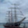

# Final-Project image-clasifier


## project description

this project is an image clasifier, based on the CIFAR10 dataset with 10 clases which are:

- airplanes 
  
- automobiles 
  
- birds
   
- cats
   
- deers
  
- dogs
  
- frogs
  
- horses
   
- ships
  
- trucks
  


## libraries used
the list of libraries used are:
- os
- argparse
- sys
- keras
- tensorflow
- csv
- tqdm

## usage
the code work wit argparse, you can ask for predict one file or all the files in a folder:
- file:
``` python3 main.py --fil <filepath>```
- folder: 
``` python3 main.py --fol <folderpath>```


## neural net
the neural net used now has a 77% accuracy in validation


## further steps
increase the neural network accuracy
